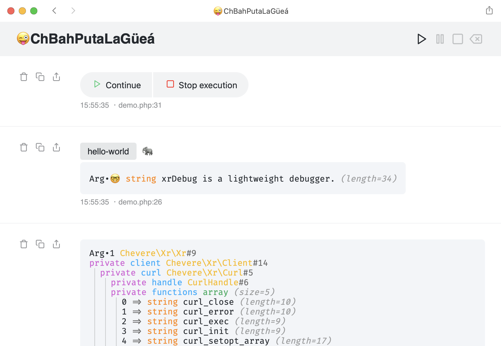

# xrDebug (PHP based server)

This is the _original_ xrDebug server written in pure PHP. You may want to check the newer implementation at [xrdebug/xrdebug](https://github.com/xrdebug/xrdebug).

Use this project if you want to bundle xrDebug in your based PHP project, just like [Chevereto](https://chevereto.com/).

<a href="https://xrdebug.com"></a>

[](https://github.com/xrdebug/xrdebug-php/actions)

[](LICENSE)
[](https://phpstan.org/)
[](https://dashboard.stryker-mutator.io/reports/github.com/xrdebug/xrdebug-php/2.0)

[](https://sonarcloud.io/dashboard?id=xrdebug_xrdebug-php)
[](https://sonarcloud.io/dashboard?id=xrdebug_xrdebug-php)
[](https://sonarcloud.io/dashboard?id=xrdebug_xrdebug-php)
[](https://sonarcloud.io/dashboard?id=xrdebug_xrdebug-php)
[](https://sonarcloud.io/dashboard?id=xrdebug_xrdebug-php)
[](https://sonarcloud.io/dashboard?id=xrdebug_xrdebug-php)
[](https://www.codefactor.io/repository/github/xrdebug/xrdebug-php)

## Installation

```sh
composer require xrdebug/xrdebug
```

<p align="center">
    
</p>
<p>
    
</p>

## Documentation

Documentation available at [docs.xrdebug.com](https://docs.xrdebug.com/).

## Features

* Ephemeral, it doesn't store any persistent data
* Signed requests (Ed25519)
* End-to-end encryption (AES-GCM AE)
* Filter messages by Topics and Emotes
* Resume, Pause, Stop and Clear debug window controls
* Keyboard shortcuts (Resume **R**, Pause **P**, Stop **S** and Clear **C**)
* Re-name "xrDebug" session to anything you want
* Export dump output to clipboard or as PNG image
* Pause and resume your code execution
* Dark / Light mode follows your system preferences
* Portable & HTML based (save page, search, etc.)
* Uses [FiraCode](https://github.com/tonsky/FiraCode) font for displaying _beautiful looking dumps_ ™
* Open with editor links
* Responsive user interface

<p align="center">
    
</p>

<p align="center">
    
</p>

## PHP Features

* Configuration via code and `xr.php` file
* Dump arguments using [VarDump](https://chevere.org/packages/var-dump.html)
* Generates dump backtrace
* Custom inspectors
* Handle errors and exceptions (hook or replace your existing handler)

## License

Copyright [Rodolfo Berrios A.](https://rodolfoberrios.com/)

xrDebug is licensed under the Apache License, Version 2.0. See [LICENSE](LICENSE) for the full license text.

Unless required by applicable law or agreed to in writing, software distributed under the License is distributed on an "AS IS" BASIS, WITHOUT WARRANTIES OR CONDITIONS OF ANY KIND, either express or implied. See the License for the specific language governing permissions and limitations under the License.
